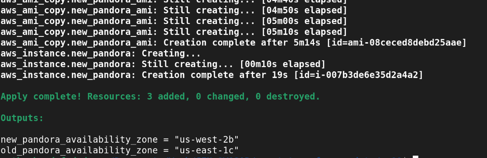

# Welcome to Quest Terraform Update
***

## Task
The task consisted to migrate an EC2 instance from one region to another.

## Description
To accomplish this task, i go through the following process.

- Create an image based on the `us-east-1` instance.
- Copy this image to the `us-west-2` region.
- Create a new EC2 instance based on the copied image.
- Sync the configuration (instance_type, security_groups, etc.) from the old to the new instance.

## Installation
The deployment will require to have [`aws-cli`](https://docs.aws.amazon.com/cli/latest/userguide/getting-started-install.html) and [`terraform`](https://developer.hashicorp.com/terraform/tutorials/aws-get-started/install-cli).

Don't forget to config your credentials using [`aws configure`](https://docs.aws.amazon.com/cli/latest/userguide/cli-configure-files.html).

Now, deploy a simple EC2 instance using this terraform script.

```tf
provider "aws" {
  region = "us-east-1"
}

resource "aws_instance" "pandora" {
  ami           = "ami-0953476d60561c955"
  instance_type = "t2.micro"

  tags = {
    Name = "pandora-instance"
  }
}

output instance_id {
  value = aws_instance.pandora.id
}
```

NB: Make sure to copy the `instance_id`.

## Usage

Using this instance_id, run the following terraform command.

```sh
terraform apply -var="old_pandora_id=<instance_id>"
```

If you got an output similar to it, then everything is ok.



### The Core Team
Brady Fomegne

<span><i>Made at <a href='https://qwasar.io'>Qwasar SV -- Software Engineering School</a></i></span>
<span></span>
